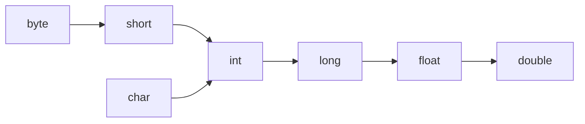

# **Java 类型转换详解**

类型转换是 Java 编程中处理不同数据类型间交互的核心机制，主要包括 **自动类型转换（隐式）** 和 **强制类型转换（显式）**。以下是详细解析：

---

#### **一、自动类型转换（隐式转换）**

##### **1. 定义**
当小范围数据类型赋值给大范围数据类型时，Java 自动完成转换，无需程序员干预。

##### **2. 适用场景**
- 赋值操作
- 算术运算中的类型提升

##### **3. 转换规则**
###### **基本数据类型转换方向（从小到大）**


###### **示例**
```java
int a = 100;
long b = a; // 自动将 int 转为 long

double x = 3.14f; // float 自动转 double
```

##### **4. 运算时的自动提升**
- 如果表达式包含不同数据类型，结果自动提升为范围最大的类型：
```java
int a = 5;
double b = 2.5;
double c = a + b; // int 自动提升为 double
```

---

#### **二、强制类型转换（显式转换）**

##### **1. 定义**
当大范围数据类型赋值给小范围数据类型时，需要显式声明转换，可能丢失精度。

##### **2. 语法**
```java
目标类型 变量名 = (目标类型)源数据;
```

##### **3. 示例**
###### **基本数据类型转换**
```java
double a = 3.14;
int b = (int)a; // 强制转换为 int，b=3（丢失小数部分）

long c = 300L;
short d = (short)c; // 若 c 在 short 范围内，无问题
```

###### **对象类型转换**
```java
Object obj = "Hello";
String str = (String)obj; // 强制转换为 String
```

##### **4. 注意事项**
- **数据溢出风险**：
```java
int a = 200;
byte b = (byte)a; // b=-56（溢出）
```
- **布尔类型不可转换**：
```java
// boolean flag = (boolean)1; // 编译错误！
```

---

#### **三、特殊类型转换场景**

##### **1. 字符串与其他类型的转换**
###### **其他类型 → 字符串**
```java
int a = 10;
String s1 = a + ""; // 方法1：拼接空字符串
String s2 = String.valueOf(a); // 方法2：推荐方式
```

###### **字符串 → 其他类型**
```java
String s = "123";
int a = Integer.parseInt(s); // String 转 int
double b = Double.parseDouble(s); // String 转 double
```

##### **2. 包装类与基本类型的转换（自动装箱/拆箱）**
```java
// 自动装箱
Integer i = 10; // 编译器转换为 Integer.valueOf(10)

// 自动拆箱
int j = i; // 编译器转换为 i.intValue()
```

---

#### **四、类型转换的底层原理**

##### **1. 基本数据类型转换**
- **扩展填充**（小转大）：
  - `int` → `long`：高位补0
  - `float` → `double`：扩展小数位
- **截断丢弃**（大转小）：
  - `double` → `int`：直接丢弃小数部分
  - `long` → `short`：仅保留低16位

##### **2. 对象类型转换**
- **向上转型（Upcasting）**：子类→父类（自动完成）
```java
Animal cat = new Cat(); // Cat 是 Animal 的子类
```
- **向下转型（Downcasting）**：父类→子类（需强制转换）
```java
Animal animal = new Cat();
Cat cat = (Cat)animal; // 需运行时检查类型
```

---

#### **五、常见面试问题**

##### **1. `int` 和 `Integer` 的区别？**
- `int` 是基本类型，`Integer` 是包装类。
- `Integer` 支持 `null`，而 `int` 默认值为0。

##### **2. 以下代码的输出是什么？**
```java
double a = 5 / 2;
System.out.println(a); // 2.0（整数除法后转 double）
```
**修正方法**：
```java
double a = 5.0 / 2; // 或 5 / 2.0
```

##### **3. 如何避免强制转换时的 `ClassCastException`？**
使用 `instanceof` 检查类型：
```java
if (animal instanceof Cat) {
    Cat cat = (Cat)animal;
}
```

---

#### **六、总结**

| **转换类型** | **方向**        | **风险**             | **示例**                  |
| ------------ | --------------- | -------------------- | ------------------------- |
| 自动类型转换 | 小类型 → 大类型 | 无                   | `long b = 100;`           |
| 强制类型转换 | 大类型 → 小类型 | 可能溢出或精度丢失   | `int a = (int)3.14;`      |
| 字符串转数字 | `String` → 数值 | 格式错误抛异常       | `Integer.parseInt("123")` |
| 对象向下转型 | 父类 → 子类     | `ClassCastException` | `(Cat)animal`             |

掌握这些规则后，你就能安全高效地处理 Java 中的类型转换！ 🚀