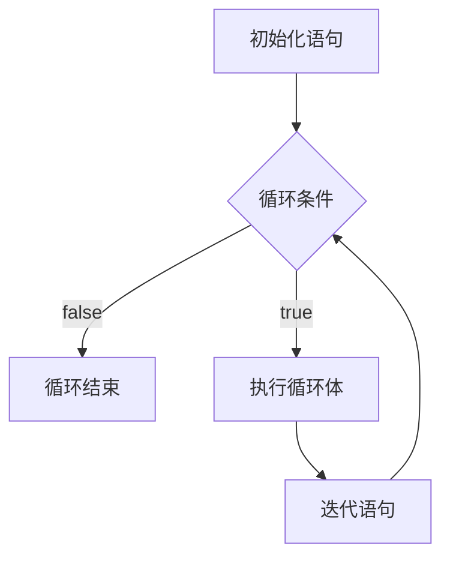
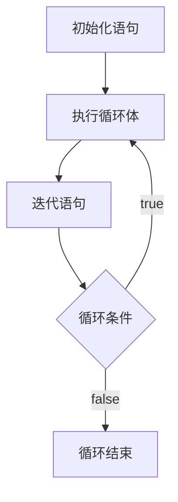
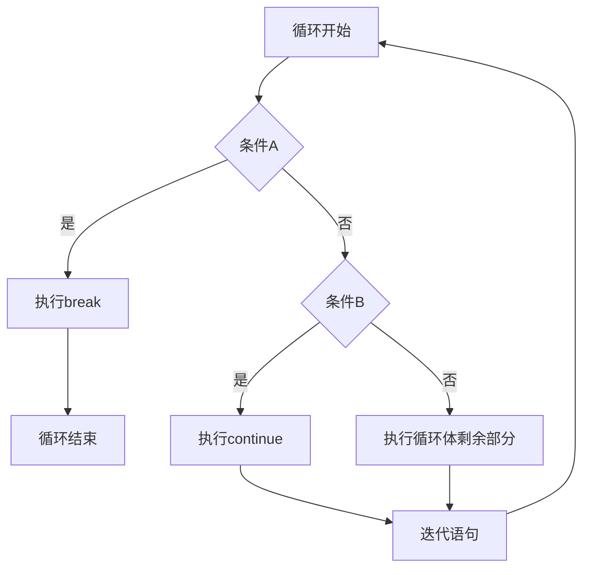

# **Java 循环详解（含语法、流程、控制与高级用法）**

循环是 Java 编程中的核心结构，用于重复执行代码块。Java 提供了 **`while`**、**`do-while`** 和 **`for`** 三种主要循环类型，适用于不同场景。

---

## **一、循环的核心类型与语法**

### **1. `while` 循环**
#### **语法结构**
```java
初始化语句;
while (循环条件) {
    循环体;
    迭代语句; // 控制循环变量变化（如 i++）
}
```

#### **执行流程**


#### **示例：打印 1~5**
```java
int i = 1; // 初始化
while (i <= 5) { // 条件：i 不超过 5
    System.out.println(i);
    i++; // 迭代（避免死循环）
}
// 输出：1 2 3 4 5
```

---

### **2. `do-while` 循环**
#### **语法结构**
```java
初始化语句;
do {
    循环体;
    迭代语句;
} while (循环条件); // 注意末尾分号
```

#### **执行流程**（先执行后判断，至少执行一次）


#### **示例：用户输入验证**
```java
Scanner scanner = new Scanner(System.in);
int num;
do {
    System.out.print("输入 1~10 的数字：");
    num = scanner.nextInt();
} while (num < 1 || num > 10); // 条件不满足则重复输入
System.out.println("输入正确：" + num);
```

---

### **3. `for` 循环**（最常用）
#### **语法结构**
```java
for (初始化语句; 循环条件; 迭代语句) {
    循环体;
}
```

#### **执行流程**


#### **示例：遍历数组**
```java
int[] arr = {1, 2, 3, 4};
for (int i = 0; i < arr.length; i++) { // i 从 0 到数组长度-1
    System.out.println(arr[i]);
}
// 输出：1 2 3 4
```

#### **增强 `for` 循环（for-each，Java 5+）**
用于遍历集合或数组，无需索引：
```java
for (元素类型 变量 : 数组/集合) {
    循环体; // 变量直接获取当前元素
}
// 示例：遍历数组
for (int num : arr) {
    System.out.println(num);
}
```

---

## **二、循环控制：`break` 与 `continue`**

### **1. `break`：终止整个循环**
直接跳出循环，不再执行后续迭代。
```java
// 示例：找到 10 以内的第一个偶数
for (int i = 1; i <= 10; i++) {
    if (i % 2 == 0) {
        System.out.println("第一个偶数：" + i);
        break; // 找到后立即终止循环
    }
}
// 输出：第一个偶数：2（循环只执行到 i=2）
```

---

### **2. `continue`：跳过当前迭代**
跳过循环体剩余部分，直接进入下一次迭代。
```java
// 示例：打印 1~10 的奇数（跳过偶数）
for (int i = 1; i <= 10; i++) {
    if (i % 2 == 0) {
        continue; // 遇到偶数则跳过后续打印
    }
    System.out.println(i);
}
// 输出：1 3 5 7 9
```

---

### **3. `break` vs `continue` 执行对比**


---

## **三、高级用法：带标签的循环（Labeled Loop）**

### **1. 作用**
当循环嵌套时，使用 **标签（Label）** 可指定 `break` 或 `continue` 作用于外层循环（默认只作用于当前循环）。

---

### **2. 语法结构**
```java
标签名: for (循环条件) { // 外层循环带标签
    for (循环条件) { // 内层循环
        if (条件) {
            break 标签名; // 终止外层循环
            // 或 continue 标签名; // 跳过外层循环的当前迭代
        }
    }
}
```

---

### **3. 示例：跳出嵌套循环**
```java
// 找到二维数组中第一个大于 10 的元素，并终止所有循环
int[][] matrix = {{1, 5}, {8, 12}, {3, 7}};
outer: // 外层循环标签
for (int i = 0; i < matrix.length; i++) {
    for (int j = 0; j < matrix[i].length; j++) {
        if (matrix[i][j] > 10) {
            System.out.println("找到：" + matrix[i][j]);
            break outer; // 直接终止 outer 标签对应的外层循环
        }
    }
}
// 输出：找到：12（外层循环在 i=1 时被终止）
```

---

## **四、需掌握的其他关键知识点**

### **1. 循环的选择原则**
| 循环类型   | 适用场景                                     | 特点                                 |
| ---------- | -------------------------------------------- | ------------------------------------ |
| `while`    | 循环次数不确定（依赖条件）                   | 先判断后执行，可能一次不执行         |
| `do-while` | 循环次数不确定，但至少执行一次（如输入验证） | 先执行后判断，至少执行一次           |
| `for`      | 循环次数确定（如遍历数组）                   | 初始化、条件、迭代写在一行，结构清晰 |
| 增强 `for` | 遍历集合或数组，无需索引                     | 无法修改数组长度或索引，只读遍历     |

---

### **2. 避免死循环**
死循环是循环条件永远为 `true` 导致无法终止的错误，常见原因及解决：
- **忘记迭代语句**：如 `while (i < 5) { System.out.println(i); }`（缺少 `i++`）。
- **循环条件恒为 `true`**：如 `while (true) { ... }`（需确保内部有 `break` 终止）。

**安全写法**：
```java
// 有条件的无限循环（必须包含 break）
while (true) {
    if (条件) {
        break; // 确保满足条件时能退出
    }
}
```

---

### **3. 循环嵌套的执行顺序**
外层循环执行 1 次，内层循环执行全部次数，例如：
```java
// 打印 3 行 4 列星号
for (int i = 0; i < 3; i++) { // 外层：控制行数
    for (int j = 0; j < 4; j++) { // 内层：控制每行列数
        System.out.print("*");
    }
    System.out.println(); // 换行
}
// 输出：
// ****
// ****
// ****
```

---

### **4. 循环与数组/集合的结合**
遍历数组或集合是循环的核心应用场景，例如：
```java
// 使用 for-each 遍历 List 集合
List<String> list = Arrays.asList("A", "B", "C");
for (String item : list) {
    System.out.println(item);
}
```

---

## **五、总结**

| 知识点       | 重点内容                                                     |
| ------------ | ------------------------------------------------------------ |
| **基础循环** | `while`（条件驱动）、`do-while`（至少一次）、`for`（次数固定）、增强 `for`（遍历）。 |
| **循环控制** | `break`（终止循环）、`continue`（跳过当前迭代）。            |
| **高级用法** | 带标签的循环（嵌套循环跳转）、无限循环（需配合 `break` 使用）。 |
| **避坑要点** | 避免死循环（检查迭代语句）、增强 `for` 不可修改集合结构。    |

掌握循环是实现复杂逻辑的基础，重点练习 **嵌套循环** 和 **循环控制（`break`/`continue`）** 的使用场景，并根据实际需求选择合适的循环类型。