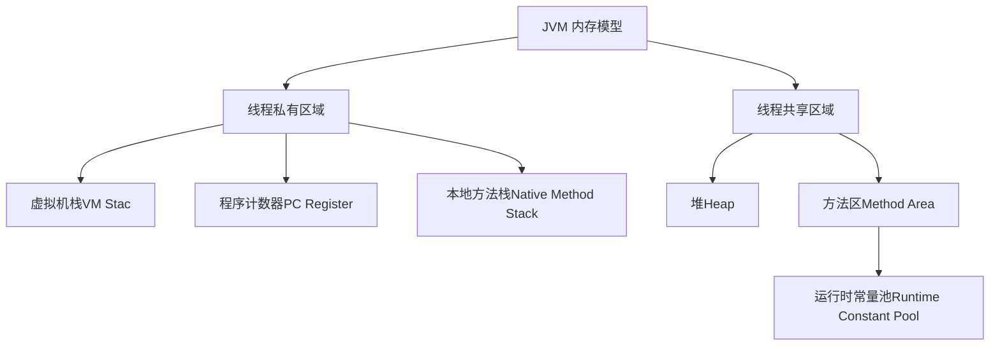
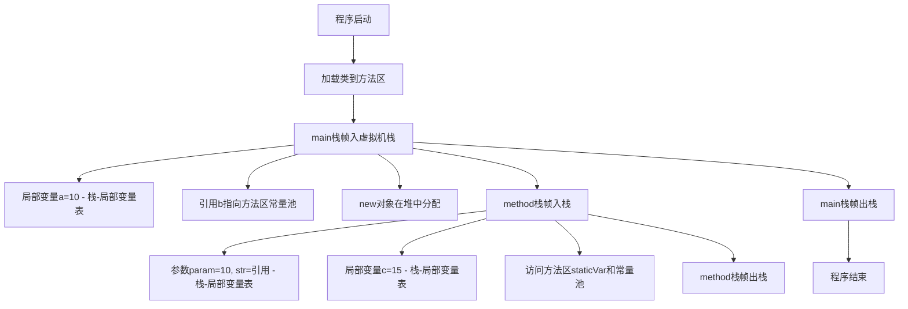

# **Java 虚拟机（JVM）内存模型详解**

## **一、JVM 内存模型总览**
Java 虚拟机（JVM）的内存模型定义了 Java 程序运行时内存的分配和管理方式，主要分为 **线程私有区域** 和 **线程共享区域**。其中最核心的三个区域是：
- **虚拟机栈（VM Stack）**
- **堆（Heap）**
- **方法区（Method Area）**

以下是 JVM 内存模型的结构示意图：



---

## **二、JVM 内存的三大核心区域**

### **1. 虚拟机栈（VM Stack）**
#### **（1）定义**
- **线程私有**：每个线程对应一个虚拟机栈，生命周期与线程一致。
- **栈帧（Stack Frame）**：虚拟机栈由多个栈帧组成，每个方法调用都会创建一个栈帧，存储 **局部变量表、操作数栈、动态链接、方法返回地址** 等信息。
- **后进先出（LIFO）**：方法调用时入栈，方法结束时出栈。

#### **（2）核心功能**
- **管理方法调用**：记录方法的执行状态（如参数、局部变量、返回地址等）。
- **存储局部变量**：包括基本类型（如 `int`、`boolean`）和引用类型的引用（对象地址）。

#### **（3）特点**
- **内存大小固定**：通过 `-Xss` 参数调整（如 `-Xss256k`），超出限制会抛出 **StackOverflowError**（栈溢出，如递归过深）。
- **访问速度快**：直接分配在寄存器或连续内存中，效率高于堆。

#### **（4）栈帧结构**
| **组成部分**     | **作用**                                                     |
| ---------------- | ------------------------------------------------------------ |
| **局部变量表**   | 存储方法的参数和局部变量（容量在编译期确定）。               |
| **操作数栈**     | 用于方法执行过程中的临时数据存储（如计算 `a + b` 的操作数）。 |
| **动态链接**     | 将符号引用转换为直接引用（运行时解析）。                     |
| **方法返回地址** | 方法结束后返回的地址（如 `return` 后的下一条指令）。         |

---

### **2. 堆（Heap）**
#### **（1）定义**
- **线程共享**：堆是所有线程共享的内存区域，是 JVM 中最大的一块内存。
- **存储对象实例**：几乎所有对象（如 `new Object()`）和数组都在堆中分配内存。

#### **（2）核心功能**
- **对象存储**：存储对象的属性值（成员变量）和对象头信息（如哈希码、GC 分代年龄）。
- **垃圾回收（GC）**：堆是垃圾回收的主要区域，通过垃圾回收器自动回收不再使用的对象内存。

#### **（3）特点**
- **动态分配内存**：大小可通过 `-Xms`（初始堆大小）和 `-Xmx`（最大堆大小）调整（如 `-Xms512m -Xmx1g`）。
- **内存效率较低**：分配和回收需要垃圾回收器介入，速度慢于栈。
- **可能抛出 OutOfMemoryError**：堆内存不足时触发（如创建大量对象且未回收）。

#### **（4）堆内存结构（JDK 8+）**
| **区域**                | **作用**                                                     |
| ----------------------- | ------------------------------------------------------------ |
| **新生代（Young）**     | 存储新创建的对象，分为 **Eden**（伊甸园区）和两个 **Survivor**（幸存者区 S0/S1）。 |
| **老年代（Old）**       | 存储存活较久的对象（从新生代晋升而来）。                     |
| **元空间（Metaspace）** | 替代永久代，存储类元信息（如类结构、方法数据）。             |

---

### **3. 方法区（Method Area）**
#### **（1）定义**
- **线程共享**：方法区存储类的元信息、常量、静态变量、即时编译（JIT）后的代码等。
- **JDK 8+ 实现**：由 **元空间（Metaspace）** 实现，使用本地内存；JDK 7 及之前为 **永久代（PermGen）**。

#### **（2）核心功能**
- **存储类信息**：类的结构信息（如字段、方法、接口）、父类、访问修饰符等。
- **存储常量池**：字符串常量（如 `"abc"`）、字面量（如 `123`）、符号引用（类名、方法名的符号表示）。
- **静态变量**：被 `static` 修饰的变量（如 `public static int count = 0`）。

#### **（3）特点**
- **内存大小可调整**：元空间通过 `-XX:MetaspaceSize` 和 `-XX:MaxMetaspaceSize` 调整（默认无上限，受本地内存限制）。
- **可能抛出 OutOfMemoryError**：如加载大量类（如动态生成类）导致元空间溢出。

---

## **三、代码执行流程与内存分布**
### **代码示例**
```java
public class JVMMemoryDemo {
    // 静态变量（存储在方法区）
    private static String staticVar = "静态变量";

    public static void main(String[] args) { // main方法栈帧入虚拟机栈
        int a = 10; // 局部变量（虚拟机栈-局部变量表）
        String b = "字符串常量"; // 引用指向方法区常量池
        JVMMemoryDemo obj = new JVMMemoryDemo(); // 对象实例在堆中，引用（obj）在虚拟机栈

        obj.method(a, b); // 调用method方法，新栈帧入栈
    }

    private void method(int param, String str) { // param和str在虚拟机栈-局部变量表
        int c = param + 5; // c在局部变量表，计算结果入操作数栈
        System.out.println(staticVar + str + c); // 访问方法区的静态变量和常量池
    }
}	
```

### d**执行流程图**


---

## **四、常见内存溢出问题**

| **异常类型**                          | **原因**                                | **解决方案**                                   |
| ------------------------------------- | --------------------------------------- | ---------------------------------------------- |
| **StackOverflowError**                | 虚拟机栈溢出（如递归深度过大）。        | 增大栈大小（`-Xss`），或改用迭代实现。         |
| **OutOfMemoryError: Java heap space** | 堆内存不足（如创建大量对象）。          | 增大堆大小（`-Xmx`），或优化 GC/减少对象创建。 |
| **OutOfMemoryError: Metaspace**       | 元空间溢出（如加载过多类/动态生成类）。 | 增大元空间（`-XX:MaxMetaspaceSize`）。         |

---

## **五、总结**

| **内存区域** | **线程共享性** | **存储内容**                               | **核心特点**                                           |
| ------------ | -------------- | ------------------------------------------ | ------------------------------------------------------ |
| **虚拟机栈** | 线程私有       | 方法栈帧（局部变量、操作数栈、返回地址）。 | 大小固定，速度快，可能出现 **StackOverflowError**。    |
| **堆**       | 线程共享       | 对象实例、数组。                           | 动态分配，GC 主要区域，可能出现 **OutOfMemoryError**。 |
| **方法区**   | 线程共享       | 类元信息、常量池、静态变量。               | JDK 8+ 使用元空间，可能出现 **OutOfMemoryError**。     |

理解 JVM 内存模型是优化程序性能、排查内存问题的基础，也是 Java 面试中的高频考点（如垃圾回收、字符串常量池、栈帧结构等）。

