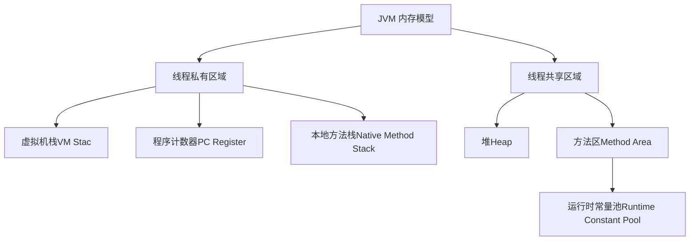
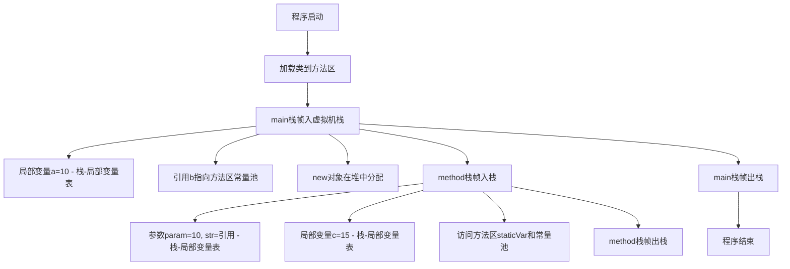

# **Java 虚拟机（JVM）内存模型详解**

## **一、JVM 内存模型总览**
Java 虚拟机（JVM）的内存模型定义了 Java 程序运行时内存的分配和管理方式，主要分为 **线程私有区域** 和 **线程共享区域**。其中最核心的三个区域是：
- **虚拟机栈（VM Stack）**
- **堆（Heap）**
- **方法区（Method Area）**

以下是 JVM 内存模型的结构示意图：



---

## **二、JVM 内存的三大核心区域**

### **1. 虚拟机栈（VM Stack）**
#### **（1）定义**
- **线程私有**：每个线程对应一个虚拟机栈，生命周期与线程一致。
- **栈帧（Stack Frame）**：虚拟机栈由多个栈帧组成，每个方法调用都会创建一个栈帧，存储 **局部变量表、操作数栈、动态链接、方法返回地址** 等信息。
- **后进先出（LIFO）**：方法调用时入栈，方法结束时出栈。

#### **（2）核心功能**
- **管理方法调用**：记录方法的执行状态（如参数、局部变量、返回地址等）。
- **存储局部变量**：包括基本类型（如 `int`、`boolean`）和引用类型的引用（对象地址）。

#### **（3）特点**
- **内存大小固定**：通过 `-Xss` 参数调整（如 `-Xss256k`），超出限制会抛出 **StackOverflowError**（栈溢出，如递归过深）。
- **访问速度快**：直接分配在寄存器或连续内存中，效率高于堆。

#### **（4）栈帧结构**
| **组成部分**     | **作用**                                                     |
| ---------------- | ------------------------------------------------------------ |
| **局部变量表**   | 存储方法的参数和局部变量（容量在编译期确定）。               |
| **操作数栈**     | 用于方法执行过程中的临时数据存储（如计算 `a + b` 的操作数）。 |
| **动态链接**     | 将符号引用转换为直接引用（运行时解析）。                     |
| **方法返回地址** | 方法结束后返回的地址（如 `return` 后的下一条指令）。         |

---

### **2. 堆（Heap）**
#### **（1）定义**
- **线程共享**：堆是所有线程共享的内存区域，是 JVM 中最大的一块内存。
- **存储对象实例**：几乎所有对象（如 `new Object()`）和数组都在堆中分配内存。

#### **（2）核心功能**
- **对象存储**：存储对象的属性值（成员变量）和对象头信息（如哈希码、GC 分代年龄）。
- **垃圾回收（GC）**：堆是垃圾回收的主要区域，通过垃圾回收器自动回收不再使用的对象内存。

#### **（3）特点**
- **动态分配内存**：大小可通过 `-Xms`（初始堆大小）和 `-Xmx`（最大堆大小）调整（如 `-Xms512m -Xmx1g`）。
- **内存效率较低**：分配和回收需要垃圾回收器介入，速度慢于栈。
- **可能抛出 OutOfMemoryError**：堆内存不足时触发（如创建大量对象且未回收）。

#### **（4）堆内存结构（JDK 8+）**
| **区域**                | **作用**                                                     |
| ----------------------- | ------------------------------------------------------------ |
| **新生代（Young）**     | 存储新创建的对象，分为 **Eden**（伊甸园区）和两个 **Survivor**（幸存者区 S0/S1）。 |
| **老年代（Old）**       | 存储存活较久的对象（从新生代晋升而来）。                     |
| **元空间（Metaspace）** | 替代永久代，存储类元信息（如类结构、方法数据）。             |

---

### **3. 方法区（Method Area）**
#### **（1）定义**
- **线程共享**：方法区存储类的元信息、常量、静态变量、即时编译（JIT）后的代码等。
- **JDK 8+ 实现**：由 **元空间（Metaspace）** 实现，使用本地内存；JDK 7 及之前为 **永久代（PermGen）**。

#### **（2）核心功能**
- **存储类信息**：类的结构信息（如字段、方法、接口）、父类、访问修饰符等。
- **存储常量池**：字符串常量（如 `"abc"`）、字面量（如 `123`）、符号引用（类名、方法名的符号表示）。
- **静态变量**：被 `static` 修饰的变量（如 `public static int count = 0`）。

#### **（3）特点**
- **内存大小可调整**：元空间通过 `-XX:MetaspaceSize` 和 `-XX:MaxMetaspaceSize` 调整（默认无上限，受本地内存限制）。
- **可能抛出 OutOfMemoryError**：如加载大量类（如动态生成类）导致元空间溢出。

---

## **三、代码执行流程与内存分布**
### **代码示例**
```java
public class JVMMemoryDemo {
    // 静态变量（存储在方法区）
    private static String staticVar = "静态变量";

    public static void main(String[] args) { // main方法栈帧入虚拟机栈
        int a = 10; // 局部变量（虚拟机栈-局部变量表）
        String b = "字符串常量"; // 引用指向方法区常量池
        JVMMemoryDemo obj = new JVMMemoryDemo(); // 对象实例在堆中，引用（obj）在虚拟机栈

        obj.method(a, b); // 调用method方法，新栈帧入栈
    }

    private void method(int param, String str) { // param和str在虚拟机栈-局部变量表
        int c = param + 5; // c在局部变量表，计算结果入操作数栈
        System.out.println(staticVar + str + c); // 访问方法区的静态变量和常量池
    }
}	
```

### d**执行流程图**


---

## **四、常见内存溢出问题**

| **异常类型**                          | **原因**                                | **解决方案**                                   |
| ------------------------------------- | --------------------------------------- | ---------------------------------------------- |
| **StackOverflowError**                | 虚拟机栈溢出（如递归深度过大）。        | 增大栈大小（`-Xss`），或改用迭代实现。         |
| **OutOfMemoryError: Java heap space** | 堆内存不足（如创建大量对象）。          | 增大堆大小（`-Xmx`），或优化 GC/减少对象创建。 |
| **OutOfMemoryError: Metaspace**       | 元空间溢出（如加载过多类/动态生成类）。 | 增大元空间（`-XX:MaxMetaspaceSize`）。         |

---

## **五、总结**

| **内存区域** | **线程共享性** | **存储内容**                               | **核心特点**                                           |
| ------------ | -------------- | ------------------------------------------ | ------------------------------------------------------ |
| **虚拟机栈** | 线程私有       | 方法栈帧（局部变量、操作数栈、返回地址）。 | 大小固定，速度快，可能出现 **StackOverflowError**。    |
| **堆**       | 线程共享       | 对象实例、数组。                           | 动态分配，GC 主要区域，可能出现 **OutOfMemoryError**。 |
| **方法区**   | 线程共享       | 类元信息、常量池、静态变量。               | JDK 8+ 使用元空间，可能出现 **OutOfMemoryError**。     |

理解 JVM 内存模型是优化程序性能、排查内存问题的基础，也是 Java 面试中的高频考点（如垃圾回收、字符串常量池、栈帧结构等）。


## 六、实例分析

```java
public class Person {
    // 1. 静态属性（类变量，属于类，存储在方法区，所有对象共享）
    public static String staticCountry = "中国"; // 静态变量，类加载时初始化
    
    // 2. 成员变量（实例变量，属于对象，存储在堆中，每个对象独立）
    private String name; // 姓名
    private int age;     // 年龄

    // 3. 无参构造器（初始化成员变量为默认值）
    public Person() {
        this.name = "默认姓名";
        this.age = 18; // 默认年龄
    }

    // 4. 有参构造器（接收参数初始化成员变量）
    public Person(String name, int age) {
        this.name = name;
        this.age = age;
    }

    // 5. 静态方法（属于类，不需要对象调用，存储在方法区）
    public static void showStaticCountry() {
        // 静态方法中不能访问非静态成员（无this），但可以访问静态属性
        System.out.println("静态方法：当前国家=" + staticCountry);
    }

    // 6. 成员方法（属于对象，需要通过对象调用，存储在方法区）
    public void show() {
        // 局部变量（方法内定义，存储在虚拟机栈的show栈帧中，作用域仅在方法内）
        int count = 1; // 局部变量，初始值1
        System.out.println("第" + count + "次打印（成员方法）：姓名=" + this.name + "，年龄=" + this.age);
        count++; // 局部变量修改（不影响堆中的成员变量）
    }

    // 7. 主方法（程序入口，存储在方法区，虚拟机栈的第一个栈帧）
    public static void main(String[] args) {
        // （1）访问静态属性（不需要对象，直接通过类名访问，方法区）
        System.out.println("main方法：初始静态国家=" + Person.staticCountry);

        // （2）调用静态方法（不需要对象，直接通过类名调用，虚拟机栈创建showStaticCountry栈帧）
        Person.showStaticCountry();

        // （3）创建对象（无参构造器，堆中分配内存，初始化成员变量）
        Person p1 = new Person(); // p1是局部变量，存储在main栈帧的局部变量表中，指向堆中的对象
        p1.show(); // 调用成员方法，虚拟机栈创建show栈帧，this指向p1

        // （4）创建对象（有参构造器，堆中分配新内存，初始化成员变量）
        Person p2 = new Person("张三", 25); // p2是局部变量，指向堆中的另一个对象
        p2.show(); // 调用成员方法，this指向p2

        // （5）修改静态属性（所有对象共享，方法区的值被修改）
        Person.staticCountry = "中华人民共和国";
        System.out.println("main方法：修改后静态国家=" + Person.staticCountry);

        // （6）再次调用静态方法（验证静态属性变化）
        Person.showStaticCountry();
    }
}
```


> ### 一、类加载阶段：**“从上到下”扫描类信息，一次性完成元信息和常量池初始化**
>
> #### 1. 类元信息记录
> JVM在类加载阶段会按代码顺序扫描并记录类的元信息，具体流程如下：
>
> ```mermaid
> graph TD
> A[public class Person] --> B[静态变量]
> B --> C[成员变量]
> C --> D[构造器]
> D --> E[静态方法]
> E --> F[成员方法]
> F --> G[main方法]
> ```
>
> - **过程描述**：从 `public class Person` 开始，依次扫描类的静态变量、成员变量、构造器、静态方法、成员方法和 `main` 方法，将所有信息记录到**方法区**的类元信息中。
> - **注意**：此阶段仅“读取并登记”代码信息，不执行任何逻辑。
>
> #### 2. 常量池初始化
> JVM扫描类中的所有**字符串字面量**（如 `"中国"`、`"静态方法：当前国家="`、`"main方法：初始静态国家="` 等），将它们一次性加载到**运行时常量池**中。  
> - **特点**：
>   - 常量池的加载发生在**类加载阶段**，与方法是否调用无关。
>   - 常量池是“类加载时预加载”，而不是“执行时动态加载”。
>
> ---
>
> ### 二、main方法执行：**栈帧入栈 → 调用其他方法 → 栈帧“后进先出”**
>
> #### 1. main栈帧入栈
> - 类加载完成后，JVM会为 `main` 方法创建一个栈帧并压入虚拟机栈（这是虚拟机栈的第一个栈帧）。
> - **局部变量表初始化**：`args`、`p1`、`p2` 等局部变量的初始值为 `null`。
>
> #### 2. 方法调用规则
> - 调用静态方法（如 `Person.showStaticCountry()`）或成员方法（如 `p1.show()`）时，JVM会为被调用方法创建新的栈帧，并将其压入虚拟机栈的栈顶。
> - **栈帧管理**：
>   - 栈顶的栈帧执行，栈底的栈帧暂停。
>   - 方法执行完毕后，其栈帧出栈，控制权返回到调用者的栈帧。
>
> #### 3. 栈的执行流程
> ```mermaid
> graph RL
> A[main栈帧] -->|调用静态方法| B[静态方法栈帧]
> B -->|执行完毕| A
> A -->|调用成员方法| C[成员方法栈帧]
> C -->|执行完毕| A
> A -->|方法结束| D[虚拟机栈清空]
> ```
>
> ---
>
> ### 三、对象创建与构造器执行：**堆内存分配 + 成员变量初始化**
>
> #### 1. `new Person()` 触发流程
> - **堆内存分配**：JVM在堆中为对象分配内存，包括对象头和成员变量的存储空间。成员变量会进行**默认初始化**（如 `name=null`，`age=0`）。
> - **构造器执行**：调用对应的构造器（无参/有参），对成员变量进行显式初始化（如无参构造器将 `name` 赋值为 `"默认姓名"`，`age` 赋值为 `18`）。
> - **引用赋值**：将堆中对象的地址赋值给 `main` 栈帧中的局部变量（如 `p1` 或 `p2`），此时局部变量从 `null` 变为指向堆对象的引用。
>
> #### 2. 流程图
> ```mermaid
> graph TD
> A[堆内存分配] --> B[成员变量默认初始化]
> B --> C[构造器执行]
> C --> D[引用赋值]
> ```
>
> ---
>
> ### 四、关键补充：构造器的本质与执行时机
>
> #### 1. 构造器执行时机
> - 构造器的执行时机是**`new` 对象时**，即堆对象创建完成后立即执行，而不是在某个方法中被显式调用。
> - 构造器的作用是**初始化堆对象的成员变量**，执行完毕后对象才算“创建完成”。
>
> #### 2. 构造器的特点
> - **无返回值**：构造器用于对象初始化，不返回任何值。
> - **不能被 `static` 修饰**：构造器是与对象绑定的特殊工具，不能作为静态方法存在。
>
> ---
>
> ### 五、最终流程简化（核心逻辑链）
>
> ```mermaid
> graph LR
> A[类加载] -->|方法区|B[类元信息+常量池]
> B --> C[main栈帧入栈]
> C --> D[调用静态方法]
> D --> E[栈帧入栈→执行→出栈]
> E --> F[new对象]
> F -->|堆分配内存→构造器初始化→引用赋值G[调用成员方法]
> G -->|this指向p对象→栈帧入栈→执行→出栈H[修改静态变量]
> H --> I[main方法执行完毕]
> I --> J[虚拟机栈清空]
> J --> K[程序结束]
> ```
>
> ---
>
> ### 总结
>
> - **类加载阶段**：完成类元信息和常量池的初始化，所有信息记录到方法区。
> - **方法调用**：栈帧按“后进先出”规则管理，静态方法和成员方法调用都遵循这一原则。
> - **对象创建**：`new` 操作触发堆内存分配和构造器初始化，引用赋值后对象才可使用。
> - **构造器的特殊性**：构造器用于对象初始化，执行时机是 `new` 对象时，不能被 `static` 修饰。
>
> 按照以上逻辑分析任何 Java 程序的运行过程，都能做到**条理清晰、细节到位**！
