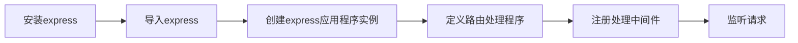

> express中文文档：https://www.expressjs.com.cn/

通过 `express`，你可以接受来自客户端的消息，并将要交给客户端的消息响应到客服端

学习目标：

- [ ] 了解express的的基本使用步骤，怎样安装下载，导入并应用实例，使用 `nodemon`及其相关配置文件，简化并减少express的重复启用
- [ ] 认识express的请求处理函数，了解请求处理函数中  `req`和 `res`的相关属性和方法
- [ ] 认识express中间件的使用方式，了解其中间件的类型和作用，学会书写一些基本的中间件

# express



## 1.安装express

```bash
npm install express
```

安装express也可以通过脚手架工具 `express-generater`来实现

```shell
npm install -g express-generator
```

## 2.导入express并创建实例

导入Express模块：在你的应用程序文件中，使用`require`语句导入Express模块：

```javascript
const express = require('express');
```

创建Express应用程序实例：通过调用`express()`函数创建一个Express应用程序实例：
```javascript
const app = express();
```

## 3.定义路由处理程序：

处理程序共同的语法结构为：

```
app.请求方法('请求路径',处理函数)
```

使用`app.get()`、`app.post()`等方法定义路由处理程序，用于处理不同路径和HTTP方法的请求。例如：

```javascript
app.get('/', (req, res) => {
  res.send('Hello, World!');
});
```

### `app.请求方法`

以 `get`请求为例：

`app.get()`是Express框架中的一个方法，用于定义处理HTTP GET请求的路由。

它的基本语法是：

```javascript
app.get(path, callback)
```

参数说明：

- `path`：表示要匹配的URL路径。可以是一个具体的路径字符串，也可以是一个带有路由参数的模式。例如，`'/'`表示根路径，`'/users/:id'`表示匹配以`/users/`开头的路径，并且将`id`作为参数传递给回调函数。
- `callback`：是一个回调函数，用于处理匹配到的路由请求。它接收两个参数：`req`（请求对象）和`res`（响应对象）。在回调函数中，你可以通过操作`req`和`res`来处理请求和发送响应。

下面是一个简单的示例，演示了如何使用`app.get()`来定义一个路由处理程序：

```javascript
app.get('/', (req, res) => {
  res.send('Hello World!')
})
```

在这个例子中，我们定义了一个根路径的路由处理程序。当有GET请求访问根路径'/'时，回调函数会被调用。在回调函数中，我们使用`res.send()`方法发送了一个包含'Hello World!'文本的响应。

你可以根据需要定义多个`app.get()`路由，用于处理不同的URL路径和GET请求。例如：

```javascript
app.get('/users', (req, res) => {
  // 处理获取用户列表的逻辑
})

app.get('/users/:id', (req, res) => {
  // 处理获取特定用户的逻辑，通过req.params.id获取路由参数
})
```

在这个例子中，我们定义了两个路由处理程序，分别用于处理'/users'路径和'/users/:id'路径。第二个路由使用了路由参数，可以通过`req.params.id`来获取路由中的参数值。

总之，`app.get()`方法是用于定义处理HTTP GET请求的路由的关键方法。它允许你根据URL路径和参数来匹配请求，并在回调函数中处理请求和发送响应。

## 4.注册中间件

使用`app.use()`方法注册中间件函数，用于处理请求和响应的中间处理逻辑。例如，可以使用`express.json()`中间件解析JSON格式的请求体：

```javascript
app.use(express.json());
```

### 中间件回调函数的结构

**基本结构**：`callback(req,res)`

该回调函数通常会定义两个参数：`req`和`res`，分别表示请求对象和响应对象。

1. `req`（请求对象）：`req`参数包含了客户端发送的HTTP请求的相关信息。它是一个包含请求头、请求体和其他属性的对象，提供了访问请求数据的方法和属性。一些常用的`req`属性和方法包括：

   - `req.params`：包含了通过路由定义的参数值。例如，如果路由定义为`/users/:id`，那么可以通过`req.params.id`获取到路由中的`id`参数值。
   - `req.query`：包含了查询参数的键值对。例如，对于URL `/users?name=John&age=25`，可以通过`req.query.name`和`req.query.age`获取到查询参数的值。
   - `req.body`：包含了请求体的数据。通常用于处理POST请求，其中包含了客户端提交的表单数据或JSON数据。
   - `req.headers`：包含了请求头的键值对。可以通过`req.headers['header-name']`来获取特定的请求头值。
   - `req.cookies`：包含了客户端发送的Cookie的键值对。
   - `req.method`：表示HTTP请求的方法，如GET、POST、PUT等。
   - `req.path`：表示请求的URL路径部分。
   - `req.ip`：表示客户端的IP地址。

2. `res`（响应对象）：`res`参数用于发送HTTP响应给客户端。它是一个包含了响应头、响应体和其他属性的对象，提供了发送响应的方法和属性。一些常用的`res`方法和属性包括：

   - `res.send()`：发送响应给客户端。可以发送文本、HTML、JSON等不同类型的响应数据。
   - `res.json()`：发送JSON格式的响应给客户端。
   - `res.status()`：设置响应的HTTP状态码。
   - `res.redirect()`：重定向客户端到另一个URL。
   - `res.sendFile()`：发送文件作为响应给客户端。
   - `res.setHeader()`：设置响应头的键值对。
   - `res.cookie()`：设置Cookie。
   - `res.clearCookie()`：清除Cookie。
   - `res.locals`：一个对象，用于在中间件和路由处理程序之间传递数据。

   > 补充：关于  `res.setHeader()` 与 `res.header()`
   >
   > `res.setHeader()` 是 Node.js 的原生方法，而 `res.header()` 是 Express 框架中的 `res.set()` 方法的别名。
   >
   > 这两个方法做的事情完全一样，就是设置 HTTP 响应的 headers。唯一的区别是 `res.setHeader()` 只允许您 **设置单个标题**，而 `res.header()` 将允许您 **设置多个标题**。因此，请使用适合您需求的那一款。
   >
   > ```javascript
   > // only a single field is set
   > res.setHeader('content-type', 'application/json');
   > 
   > // multiple fields can be set at once
   > res.set({
   >   'content-type': 'application/json',
   >   'content-length': '100',
   >   'warning': "with content type charset encoding will be added by default"
   > });
   > ```

通过使用这些`req`和`res`对象的属性和方法，你可以访问请求的数据、设置响应的内容和状态，并与客户端进行通信。这使得你能够构建出功能丰富的Web应用程序。

**其他结构**：

* `callback(req,res,next)`
* `callback(err,req,res,next)`

### 中间件类型：

在创建应用实例后，需要添加以下一些中间件来处理不同的需求：

1. 日志记录中间件：用于记录请求和响应的日志，以便进行故障排查和性能监测。常见的日志记录中间件有`morgan`和`winston`。

2. 静态文件中间件：用于提供静态文件（如HTML、CSS、JavaScript、图像等）的服务。Express框架自带了`express.static()`中间件，可以方便地提供静态文件服务。

3. 路由中间件：用于定义和处理不同路径和HTTP方法的请求。通过使用`app.get()`、`app.post()`等方法，你可以定义路由处理程序来处理不同的请求。

4. 身份验证和授权中间件：用于验证用户身份和授权访问。常见的身份验证中间件有Passport.js和`jsonwebtoken`。

5. 错误处理中间件：用于处理应用程序中的错误和异常情况。通过使用`app.use()`方法，你可以定义一个错误处理中间件函数来捕获和处理错误。

6. 请求体解析中间件：用于解析请求体中的数据。常见的请求体解析中间件有`express.urlencoded()`和`express.json()`，分别用于解析URL编码的请求体和JSON格式的请求体。

7. 会话管理中间件：用于管理用户会话状态。常见的会话管理中间件有`express-session`和`cookie-session`。

8. 安全中间件：用于增强应用程序的安全性，例如防止跨站脚本攻击（XSS）和跨站请求伪造（CSRF）攻击。常见的安全中间件有`helmet`和`csurf`。

这些中间件只是一些常见的示例，你可以根据你的应用程序需求选择和添加适合的中间件。同时，Express框架还提供了许多其他的中间件和插件，可以根据具体情况进行选择和使用。

### 中间件的注册

在Express框架中，`app.use()`方法用于注册中间件函数。它的作用是将中间件函数绑定到应用程序的请求处理管道中，以便在每个请求上执行特定的操作。

`app.use()`方法的基本语法如下：

```javascript
app.use([path], middleware)
```

参数说明：

- `path`（可选）：指定中间件函数要应用于的路径。如果未提供路径，则中间件将应用于所有请求。
- `middleware`：中间件函数，可以是一个函数或一个函数数组。中间件函数接收三个参数：`req`（请求对象）、`res`（响应对象）和`next`（下一个中间件函数）。

返回值：

- `app.use()`方法没有明确的返回值。它被用于注册中间件函数，将其添加到请求处理管道中。

下面是一个示例，演示了如何使用`app.use()`方法注册一个简单的中间件函数：

```javascript
const express = require('express');
const app = express();

// 自定义中间件函数
const myMiddleware = (req, res, next) => {
  console.log('This is a middleware function');
  next(); // 调用next()将控制权传递给下一个中间件函数
};

// 注册中间件函数
app.use(myMiddleware);

// 路由处理程序
app.get('/', (req, res) => {
  res.send('Hello, World!');
});

// 启动服务器
app.listen(3000, () => {
  console.log('Server is listening on port 3000');
});
```

在这个例子中，我们定义了一个名为`myMiddleware`的中间件函数。然后，我们使用`app.use()`方法将该中间件函数注册到应用程序中。当请求到达服务器时，中间件函数会被调用，并输出一条消息到控制台。然后，控制权会传递给下一个中间件函数或路由处理程序。

`app.use()`方法可以用于注册多个中间件函数，它们按照注册的顺序依次执行。中间件函数可以用于执行各种任务，如身份验证、日志记录、错误处理等。通过使用`app.use()`方法，你可以构建出功能强大的中间件处理管道，以满足你的应用程序需求。

## 5.启动监听服务器

通过调用`app.listen()`方法启动服务器，指定服务器监听的端口号：

```javascript
app.listen(3000, () => {
  console.log('Server is listening on port 3000');
});
```

以上是建立一个基本的Express服务器的常见步骤。当服务器启动后，它将监听指定的端口号，并根据定义的路由处理程序和中间件来处理请求和发送响应。你可以根据需要添加更多的路由和中间件来构建功能丰富的Web应用程序。

### `app.listen()`

`app.listen()`是Express框架中用于启动Web服务器的方法。它会监听指定的端口，并开始接受和处理传入的HTTP请求。

它的基本语法是：

```javascript
app.listen(port, [host], [backlog], [callback])
```

参数说明：

- `port`：要监听的端口号，通常是一个数字。例如，`3000`表示监听在端口3000上。
- `host`（可选）：要监听的主机名或IP地址。默认情况下，Express会监听所有可用的网络接口。如果你只想监听特定的主机，可以指定主机名或IP地址。例如，`'localhost'`表示只监听本地主机。
- `backlog`（可选）：指定在拒绝新连接之前，操作系统可以挂起的最大连接数。默认值是511。
- `callback`（可选）：当服务器开始监听指定端口后，会调用此回调函数。回调函数通常用于在服务器启动后执行一些额外的操作。

下面是一个简单的示例，演示了如何使用`app.listen()`来启动一个Express服务器：

```javascript
const express = require('express');
const app = express();

const port = 3000;

app.listen(port, () => {
  console.log(`Server is listening on port ${port}`);
});
```

在这个例子中，我们创建了一个Express应用程序，并使用`app.listen()`方法来启动服务器，监听在端口3000上。当服务器成功启动后，回调函数会被调用，打印出相应的消息。

你可以根据需要指定不同的端口号、主机名和回调函数来使用`app.listen()`方法。例如，你可以使用动态分配的端口号、特定的主机名或IP地址，并在回调函数中执行其他操作。

总之，`app.listen()`方法是用于启动Express服务器的关键方法。它会监听指定的端口，并开始接受和处理传入的HTTP请求。

