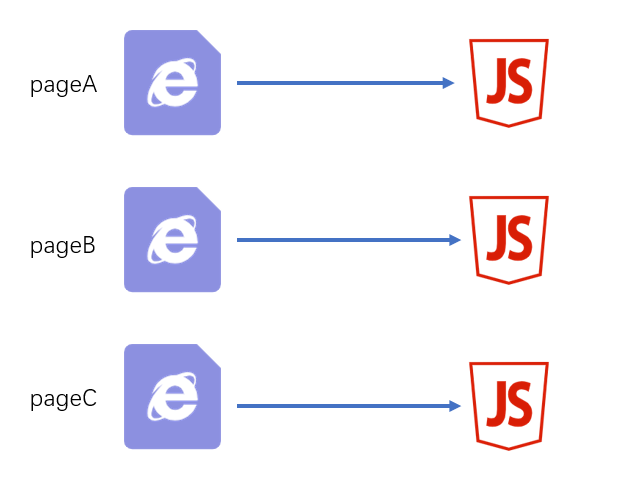
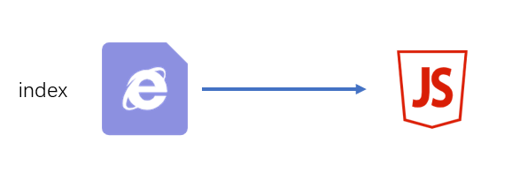

# 入口和出口


> node内置模块 - path: https://nodejs.org/dist/latest-v12.x/docs/api/path.html

**出口**

这里的出口是针对资源列表的文件名或路径的配置

出口通过output进行配置

**入口**

**入口真正配置的是chunk**

入口通过entry进行配置

规则：

- `name`：chunkname
- hash: 总的资源hash，通常用于解决缓存问题
- `chunkhash`: 使用`chunkhash`
- id: 使用`chunkid`，不推荐

配置示例：

```javascript
const path = require("path");
module.exports = {
  /* 配置chunk的入口文件，属性名为chunk的name */
  mode: "development",
  entry: {
    main: "./src/index.js", //这里chunk的name为main ，入口文件为 "./src/index.js"
    a: "./src/a.js", //这里chunk的name为a ，入口文件为 "./src/a.js"
    c:["./src/b.js","./src/c.js"]//这里的chunk会有两个入口文件
  },
  output: {
    path: path.resolve(__dirname, "./files"), //一个绝对路径，配置模块文件的输出目录
    filename: "chunk[name]hash[hash:5]chunkhash[chunkhash:5].js", //字符串，配置模块文件的输出规则，表示规则用[]包裹。规则包括了name,hash,chunkhash,id,不推荐使用id
  },
};
```

结果，在 `/files`目录下输出了这三个文件：

* `chunkmainhash4a96fchunkhashd4ef2.js`
* `chunkahash4a96fchunkhashc61a4.js`
* `chunkchash4de77chunkhash1514c`


# 入口和出口的最佳实践 {ignore}

下面是一些经典场景

## 一个页面一个JS



源码结构

```
|—— src
    |—— pageA   页面A的代码目录
        |—— index.js 页面A的启动模块
        |—— ...
    |—— pageB   页面B的代码目录
        |—— index.js 页面B的启动模块
        |—— ...
    |—— pageC   页面C的代码目录
        |—— main1.js 页面C的启动模块1 例如：主功能
        |—— main2.js 页面C的启动模块2 例如：实现访问统计的额外功能
        |—— ...
    |—— common  公共代码目录
        |—— ...
```

`webpack`配置

```js
module.exports = {
    entry:{
        pageA: "./src/pageA/index.js",
        pageB: "./src/pageB/index.js",
        pageC: ["./src/pageC/main1.js", "./src/pageC/main2.js"]
    },
    output:{
        filename:"[name].[chunkhash:5].js"
    }
}
```

这种方式适用于页面之间的功能差异巨大、公共代码较少的情况，这种情况下打包出来的最终代码不会有太多重复

## 一个页面多个JS


源码结构

```
|—— src
    |—— pageA   页面A的代码目录
        |—— index.js 页面A的启动模块
        |—— ...
    |—— pageB   页面B的代码目录
        |—— index.js 页面B的启动模块
        |—— ...
    |—— statistics   用于统计访问人数功能目录
        |—— index.js 启动模块
        |—— ...
    |—— common  公共代码目录
        |—— ...
```

`webpack`配置

```js
module.exports = {
    entry:{
        pageA: "./src/pageA/index.js",
        pageB: "./src/pageB/index.js",
        statistics: "./src/statistics/index.js"
    },
    output:{
        filename:"[name].[chunkhash:5].js"
    }
}
```

这种方式适用于页面之间有一些**独立**、相同的功能，专门使用一个chunk抽离这部分JS有利于浏览器更好的缓存这部分内容。

> 思考：为什么不使用多启动模块的方式？

## 单页应用

所谓单页应用，是指整个网站（或网站的某一个功能块）只有一个页面，页面中的内容全部靠JS创建和控制。 vue和react都是实现单页应用的利器。



源码结构

```
|—— src
    |—— subFunc   子功能目录
        |—— ...
    |—— subFunc   子功能目录
        |—— ...
    |—— common  公共代码目录
        |—— ...
    |—— index.js
```

`webpack`配置

```js
module.exports = {
    entry: "./src/index.js",
    output:{
        filename:"index.[hash:5].js"
    }
}
```

