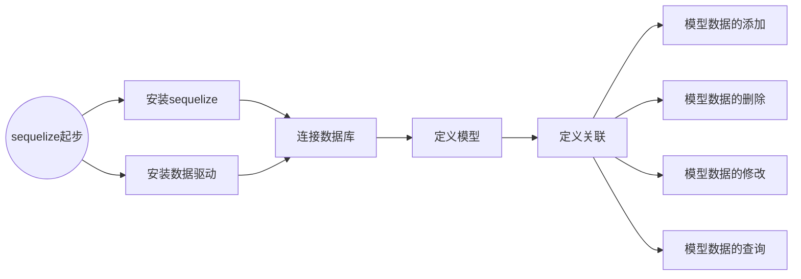
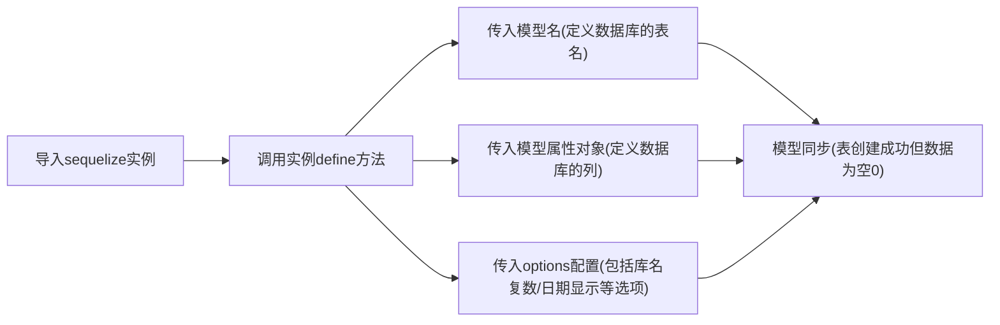

参考中文文档：https://github.com/demopark/sequelize-docs-Zh-CN





``Sequelize ``是一个基于 Node.js 的 ORM（对象关系映射）库，用于在 JavaScript 和关系型数据库之间进行映射和交互。它支持多种数据库，包括 MySQL、PostgreSQL、SQLite 和 MSSQL。

``Sequelize ``提供了一种使用 JavaScript 对象来表示数据库表和记录的方式，使开发人员可以使用面向对象的方式进行数据库操作，而不需要直接编写 SQL 查询语句。它提供了丰富的功能，包括模型定义、数据验证、查询构建、事务管理等。

## `Sequelize `起步

新建文件目录

```bash
mkdir sequelize-item
```

进入文件目录

```bash
cd sequelize-item
```

初始化项目

```bash
npm init -y
```

安装 `sequelize`

```bash
npm install --save sequelize
```

根据你使用的数据库选择安装数据库驱动

```bash
npm i pg pg-hstore # PostgreSQL
npm i mysql2 # MySQL
npm i mariadb # MariaDB
npm i sqlite3 # SQLite
npm i tedious # Microsoft SQL Server
npm i ibm_db # DB2
npm i odbc # IBM i
```

> 版本安装问题：
>
> 参照官方文档，当前直接使用npm安装 `sequelize` 时，将安装 `Sequelize v6`的版本
>
> 使用命令查看npm安装mysql2时，将安装的mysql2的版本
>
> ```bash
> npm show mysql2
> ```
>
> 返回：
>
> ```c++
> mysql2@3.6.3 | MIT | deps: 8 | versions: 160
> ...
> ```
>
> 该版本与当前 `sequelize` 并不兼容，运行时会报如下错误：
>
> ```c++
>  #initializeTTLTracking(){SyntaxError: Unexpected token...}
> ```
>
> 建议通过下面的命令查看一下 mysql2 的可安装版本，选择合适的版本安装
>
> ```bash
> npm show mysql2 versions
> ```
>
> 经过测试，mysql2在v2版本(包括v2.0.0及以上版本)以上，在v3.2版本以下(不包括v3.2及以上版本)时，当前直接安装的 `sequelize`版本不会报错。
>
> ```bash
> npm i mysql2@3.1
> ```

## 连接数据库

### 连接数据库

**新建 `models`目录:**连接数据库需要创建 `Sequelize `实例，在项目中，该文件经常被保存在 `model` 或者 `models` 文件目录下。

在使用 `Sequelize `的时候，`Sequelize` 构造函数用于创建一个 `Sequelize `实例，用于管理数据库连接和执行 ORM 操作。以下是 `Sequelize` 构造函数的参数和用法：

- `database`（必需）：要连接的数据库名称。
- `username`（可选）：连接数据库所使用的用户名。
- `password`（可选）：连接数据库所使用的密码。
- `options`（可选）：一个对象，包含其他的连接选项。可以包含以下属性：
  - `host`：MySQL 服务器的主机名，默认为 `'localhost'`。
  - `port`：MySQL 服务器的端口号，默认为 `3306`。
  - `dialect`：要使用的数据库类型，如 `'mysql'`、`'postgres'`、`'sqlite'`、`'mssql'` 等。默认为 `'mysql'`。
  - `pool`：一个对象，用于配置连接池的行为。可以包含以下属性：
    - `max`：连接池中允许的最大连接数，默认为 `5`。
    - `min`：连接池中保持的最小连接数，默认为 `0`。
    - `idle`：连接在被释放之前可以空闲的最长时间（以毫秒为单位），默认为 `10000`。
  - `logging`：一个布尔值或一个函数，用于控制日志输出。如果设置为 `false`，则禁用日志输出；如果设置为函数，则可以自定义日志输出的方式。

以下是一个示例，演示了如何使用 `Sequelize` 构造函数创建一个 `Sequelize `实例：

```javascript
const { Sequelize } = require('sequelize');

const sequelize = new Sequelize('database', 'username', 'password', {
  host: 'localhost',
  port: 3306,
  dialect: 'mysql',
  pool: {
    max: 5,
    min: 0,
    idle: 10000
  },
  logging: console.log // 输出日志到控制台
});
```

在上面的示例中，我们使用 `Sequelize` 构造函数创建了一个 `Sequelize `实例，并传递了数据库名称、用户名、密码和其他连接选项。我们指定了 MySQL 服务器的主机名、端口号，设置了连接池的最大连接数、最小连接数和空闲时间，以及日志输出的方式。

创建了 `Sequelize `实例后，我们可以使用该实例执行各种 ORM 操作，如定义模型、执行查询、进行关联等。

### 测试连接

你可以使用 `.authenticate()` 函数测试连接是否正常：

```javascript
const sequelize = require("../model/db");
(async function () {
  try {
    await sequelize.authenticate();
    console.log("Connection has been established successfully.");
  } catch (error) {
    console.error("Unable to connect to the database:", error);
  }
})();
```

### 关闭连接

默认情况下,`Sequelize` 将保持连接打开状态,并对所有查询使用相同的连接. 如果你需要关闭连接,请调用 `sequelize.close()`(这是异步的并返回一个 Promise).

**注意:** 一旦 `sequelize.close()` 被调用, 就不可能打开新的连接. 你将需要创建一个新的 `Sequelize` 实例以再次访问你的数据库.


## 定义模型




### 参数用法

在 `Sequelize` 中，`define()` 方法用于定义模型（Model）。模型是用于表示数据库中的表结构和记录的 JavaScript 对象，通过定义模型，我们可以使用面向对象的方式进行数据库操作。

以下是 `define()` 方法的参数和用法：

- `modelName`（必需）：要定义的模型的名称，通常使用单数形式。
- `attributes`（必需）：一个对象，用于定义模型的属性。每个属性都是一个键值对，其中键是属性的名称，值是一个对象，用于描述属性的数据类型和其他选项。常见的数据类型包括 `STRING`（字符串）、`INTEGER`（整数）、`BOOLEAN`（布尔值）等。
- `options`（可选）：一个对象，包含其他的模型选项。可以包含以下属性：
  - `timestamps`：一个布尔值或对象，用于指定是否自动添加 `createdAt` 和 `updatedAt` 字段。如果设置为 `true`，则会自动添加这两个字段；如果设置为 `false`，则不会添加；如果设置为对象，则可以进一步配置这两个字段的名称和数据类型。
  - `freezeTableName`：一个布尔值，用于指定是否使用与模型名称完全相同的表名。如果设置为 `true`，则使用模型名称作为表名；如果设置为 `false`，则 `Sequelize` 会将模型名称转换为复数形式并用作表名。
  - 其他选项：还可以包含其他的模型选项，如 `tableName`（指定表名）、`charset`（指定字符集）等。

以下是一个示例，演示了如何使用 `define()` 方法定义一个名为 `User` 的模型：

```javascript
const { Sequelize, DataTypes } = require('sequelize');

const sequelize = new Sequelize('database', 'username', 'password', {
  host: 'localhost',
  dialect: 'mysql'
});

const User = sequelize.define('User', {
  name: {
    type: DataTypes.STRING,
    allowNull: false
  },
  age: {
    type: DataTypes.INTEGER,
    allowNull: false
  }
}, {
  timestamps: true,
  freezeTableName: true
});
```

在上面的示例中，我们使用 `define()` 方法定义了一个名为 `User` 的模型。该模型具有两个属性：`name` 和 `age`，分别是字符串类型和整数类型。我们还指定了 `timestamps: true`，表示要自动添加 `createdAt` 和 `updatedAt` 字段，并设置了 `freezeTableName: true`，表示使用模型名称作为表名。

> 补充：
>
> * 如果是 `My SQL`  数据库，在定义模型属性时，往往忽略数据库主键，模型会自动定义。
>
> * 在defined()传入的第三个对象参数中，`freezeTableName`用来指定相同表名， `tableName`用来直接指定表名。这是因为在定义模型时会自动进行[表名推断](https://github.com/demopark/sequelize-docs-Zh-CN/blob/v6/core-concepts/model-basics.md#%E8%A1%A8%E5%90%8D%E6%8E%A8%E6%96%AD)，将定义的模型名复数化作为新的表名。而通过上面的传键值对给参数对象可以改变默认的表名推断。

### 定义模型属性（数据库的列）

是的，除了 `type` 和 `allowNull`，在定义模型属性时还可以使用其他键值对来定义属性的其他选项。以下是一些常见的属性选项：

- `defaultValue`：指定属性的默认值。例如：

  ```javascript
  age: {
    type: DataTypes.INTEGER,
    allowNull: false,
    defaultValue: 18
  }
  ```

- `primaryKey`：指定属性是否为主键。默认情况下，`Sequelize` 会自动创建一个名为 `id` 的属性作为主键，但你也可以通过设置 `primaryKey: true` 来指定其他属性作为主键。例如：

  ```javascript
  userId: {
    type: DataTypes.INTEGER,
    primaryKey: true
  }
  ```

- `autoIncrement`：指定属性是否自动递增。当属性被指定为主键时，可以通过设置 `autoIncrement: true` 来启用自动递增。例如：

  ```javascript
  userId: {
    type: DataTypes.INTEGER,
    primaryKey: true,
    autoIncrement: true
  }
  ```

- `unique`：指定属性是否唯一。通过设置 `unique: true`，可以确保属性的值在表中是唯一的。例如：

  ```javascript
  email: {
    type: DataTypes.STRING,
    unique: true
  }
  ```

- `validate`：指定属性的验证规则。使用 `validate`，可以定义一个函数或一个包含验证规则的对象来验证属性的值。例如：

  ```javascript
  email: {
    type: DataTypes.STRING,
    validate: {
      isEmail: true
    }
  }
  ```

- `references` 和 `referencesKey`：用于定义外键关系。`references` 指定外键关联的模型名称，`referencesKey` 指定外键关联的属性名称。例如：

  ```javascript
  postId: {
    type: DataTypes.INTEGER,
    references: 'Post',
    referencesKey: 'id'
  }
  ```

这些是一些常见的属性选项，具体的选项和用法可能会根据使用的库版本和需求而有所不同。建议查阅 `Sequelize` 的官方文档以获取更详细的信息和示例代码。

### 定义模型属性类型（模型实例的数据类型）

在 `Sequelize` 中，`DataTypes` 是一个包含各种数据类型的对象，用于定义模型属性的数据类型。通过使用 `DataTypes`，我们可以指定模型属性的数据类型以及其他约束条件。

以下是一些常见的数据类型和其对应的 `DataTypes` 属性：

- `STRING`：字符串类型，用于表示文本数据。
- `INTEGER`：整数类型，用于表示整数数据。
- `FLOAT`：浮点数类型，用于表示小数数据。
- `BOOLEAN`：布尔值类型，用于表示真/假值。
- `DATE`：日期类型，用于表示日期和时间。
- `ENUM`：枚举类型，用于表示一组预定义的值。
- `JSON`：JSON 类型，用于表示 JSON 数据。
- `ARRAY`：数组类型，用于表示一组值的数组。

除了上述常见的数据类型，`DataTypes` 还提供了其他数据类型，如 `UUID`、`UUIDV4`、`UUIDV1`（用于表示 UUID）、`BLOB`（用于表示二进制数据）、`TEXT`（用于表示长文本数据）等。

以下是一个示例，演示了如何使用 `DataTypes` 定义模型属性的数据类型：

```javascript
const { Sequelize, DataTypes } = require('sequelize');

const sequelize = new Sequelize('database', 'username', 'password', {
  host: 'localhost',
  dialect: 'mysql'
});

const User = sequelize.define('User', {
  name: {
    type: DataTypes.STRING,
    allowNull: false
  },
  age: {
    type: DataTypes.INTEGER,
    allowNull: false
  },
  height: {
    type: DataTypes.FLOAT,
    allowNull: true
  },
  isActive: {
    type: DataTypes.BOOLEAN,
    defaultValue: true
  },
  birthDate: {
    type: DataTypes.DATE,
    allowNull: true
  },
  role: {
    type: DataTypes.ENUM('admin', 'user', 'guest'),
    allowNull: false
  },
  metadata: {
    type: DataTypes.JSON,
    allowNull: true
  },
  tags: {
    type: DataTypes.ARRAY(DataTypes.STRING),
    allowNull: true
  }
});
```

在上面的示例中，我们使用 `DataTypes` 定义了 `User` 模型的各个属性的数据类型。例如，`name` 属性的数据类型为 `STRING`，`age` 属性的数据类型为 `INTEGER`，`height` 属性的数据类型为 `FLOAT`，`isActive` 属性的数据类型为 `BOOLEAN`，`birthDate` 属性的数据类型为 `DATE`，`role` 属性的数据类型为 `ENUM`，`metadata` 属性的数据类型为 `JSON`，`tags` 属性的数据类型为 `ARRAY(DataTypes.STRING)`。

通过使用适当的数据类型，我们可以确保模型属性的数据类型与数据库中对应列的数据类型匹配，从而实现数据的正确存储和检索。

### 定义可选options

在 `Sequelize` 的 `define()` 方法中，可以使用 `options` 参数对象来指定一些可选属性。以下是一些常用的 `options` 属性：

- `timestamps`：指定是否自动添加 `createdAt` 和 `updatedAt` 字段来记录模型的创建时间和更新时间。默认值为 `true`，表示启用自动添加。如果设置为 `false`，则不会添加这两个字段。例如：

  ```javascript
  const User = sequelize.define('User', {
    // 属性定义
  }, {
    timestamps: false
  });
  ```

- `tableName`：指定模型对应的数据库表的名称。如果不指定，则 Sequelize 会根据模型名称自动推断表名。例如：

  ```javascript
  const User = sequelize.define('User', {
    // 属性定义
  }, {
    tableName: 'users'
  });
  ```

- `underscored`：指定是否使用下划线命名规则来命名数据库表和字段。默认值为 `false`，表示使用驼峰命名规则。如果设置为 `true`，则使用下划线命名规则。例如：

  ```javascript
  const User = sequelize.define('User', {
    // 属性定义
  }, {
    underscored: true
  });
  ```

- `paranoid`：指定是否启用软删除功能。默认值为 `false`，表示禁用软删除。如果设置为 `true`，则启用软删除，在删除记录时会自动设置 `deletedAt` 字段的值，而不是真正从数据库中删除记录。例如：

  ```javascript
  const User = sequelize.define('User', {
    // 属性定义
  }, {
    paranoid: true
  });
  ```

- `freezeTableName`：指定是否禁止自动将模型名称复数化来命名数据库表。默认值为 `false`，表示允许复数化。如果设置为 `true`，则禁止复数化，使用与模型名称相同的表名。例如：

  ```javascript
  const User = sequelize.define('User', {
    // 属性定义
  }, {
    freezeTableName: true
  });
  ```

这些是一些常用的 `options` 属性，具体的选项和用法可能会根据使用的库版本和需求而有所不同。

### 模型同步

定义模型时,你要告诉 `Sequelize` 有关数据库中表的一些信息. 但是,如果该表实际上不存在于数据库中怎么办？ 如果存在,但具有不同的列,较少的列或任何其他差异,该怎么办？

这就是模型同步的来源.可以通过调用一个异步函数(返回一个Promise)[`model.sync(options)`](https://sequelize.org/api/v6/class/src/model.js~Model.html#static-method-sync). 通过此调用,`Sequelize` 将自动对数据库执行 SQL 查询. 请注意,这仅更改数据库中的表,而不更改 JavaScript 端的模型.

下面的 `User` 是调用 `define()`方法后返回的实例（模型）

- `User.sync()` - 如果表不存在,则创建该表(如果已经存在,则不执行任何操作)
- `User.sync({ force: true })` - 将创建表,如果表已经存在,则将其首先删除
- `User.sync({ alter: true })` - 这将检查数据库中表的当前状态(它具有哪些列,它们的数据类型等),然后在表中进行必要的更改以使其与模型匹配.

你可以使用 [`sequelize.sync()`](https://sequelize.org/api/v6/class/src/sequelize.js~Sequelize.html#instance-method-sync) 自动同步所有模型. 示例：

```javascript
await sequelize.sync({ force: true });
console.log("所有模型均已成功同步.");
```

## 定义关联

参考文档：https://github.com/demopark/sequelize-docs-Zh-CN/blob/v6/core-concepts/assocs.md

## 案例：

学校数据库有四张表

### 管理员

| id   | 账号 | 密码 | 姓名 |
| ---- | ---- | ---- | ---- |

### 班级

| id   | 名称 | 开班时间 |
| ---- | ---- | -------- |

### 学生

| id   | 姓名 | 出生日期 | 性别 | 联系电话 | 所属班级 |
| ---- | ---- | -------- | ---- | -------- | -------- |

### 书籍

| id   | 名称 | 图片 | 出版时间 | 作者 |
| ---- | ---- | ---- | -------- | ---- |

利用定义模型来创建这四张表：

1. 管理员

   ```javascript
   const sequelize = require("./db");
   const { DataTypes } = require("sequelize");
   const Admin = sequelize.define(
     "Admin",
     {
       loginId: {
         type: DataTypes.STRING,
         allowNull: false,
       },
       loginPwd: {
         type: DataTypes.STRING,
         allowNull: false,
       },
       name: {
         type: DataTypes.STRING,
         allowNull: false,
       },
     },
     {
       timestamps: false,
       freezeTableName: true,
     }
   );
   (async function () {
     await Admin.sync({ alter: true });
     console.log("模型Admin同步完成");
   })();
   module.exports = Admin;
   ```

2. 
