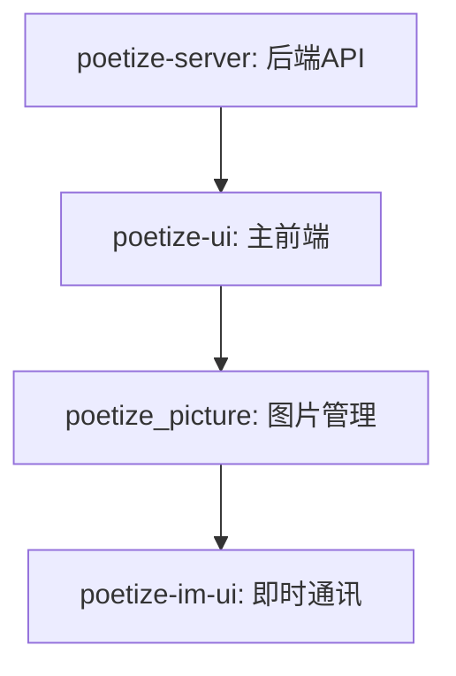
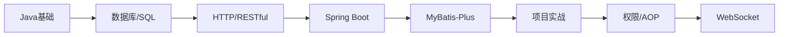

## 一、前言

昨日仿佛一场梦，账号密码都过期了，我的过去的大学生涯已经彻底死了，不留一点回忆。

现在是该启程开始新的项目了。我不知道前路如何，一切都还是未知数……

我付费购买了一个项目，我希望通过ai+自学能将其技术栈研究透彻。

## 二、项目分析

先分析其目录结构

这里可以安装使用一个命令在终端显示项目的目录结构

```bash
yay -S tree
```

tree的简介及常用用法

`tree` 是一个用于以树状结构显示目录内容的命令行工具，支持多种选项来定制输出格式和行为。以下常用的选项：

- 基本选项
  - `-a`：显示所有文件
  - `-d`：仅显示目录，不显示文件
  - `-f`：显示文件的完整路径
  - `-p`：显示文件的权限
  - `-s`：显示文件的大小（字节）
  - `-h`：以人类可读的格式（KB、MB、GB）显示文件大小
- 目录深度控制
  - `-L`：限制显示的目录深度
  - `-R`：递归遍历目录，结合 `-L`使用
- **模式匹配**
  - `-P pattern`：仅显示匹配模式的文件（如 `-P "*.txt"`）。
  - `-I pattern`：排除匹配模式的文件（如 `-I "*.log"`）。
  - `--matchdirs`：使 `-P` 也匹配目录名。
  - `--ignore-case`：模式匹配时忽略大小写
- **Git 集成**
  - `--gitignore`：使用 `.gitignore` 规则过滤文件。
  - `--gitfile=file`：指定自定义 `.gitignore` 文件。
- **排序选项**
  - `--sort=name`：按名称排序（默认）。
  - `--sort=size`：按文件大小排序。
  - `--sort=date`：按修改时间排序。
  - `--dirsfirst`：先显示目录，后显示文件。
  - `--filesfirst`：先显示文件，后显示目录。


## 三、开发顺序

**项目结构分析：**

项目目录树状结构

```bash
.
├── poetize-im-ui
├── poetize_picture
├── poetize-server
├── poetize-ui
├── LICENSE
└── README.md
```

**项目组成**

| 目录/文件           | 说明                                                         |
| ------------------- | ------------------------------------------------------------ |
| **poetize-server**  | **后端服务**（如 Spring Boot、Node.js 等），提供 API 和业务逻辑处理 |
| **poetize-ui**      | **主前端项目**（如 Vue/React），用户交互界面                 |
| **poetize-im-ui**   | **即时通讯前端模块**（可能是独立的 IM 界面，如 WebSocket 实现） |
| **poetize_picture** | **图片资源目录**（可能存储用户上传的图片或静态素材）         |
| **LICENSE**         | 开源协议（如 MIT、Apache 等）                                |
| **README.md**       | 项目说明文档（部署指南、功能介绍等）                         |


**推荐开发顺序：**


在开发顺序上，建议采用 **“核心功能优先，逐步扩展”** 的策略。以下是具体推荐顺序和理由：

### **1. 第一步：开发后端核心（`poetize-server`）**

**优先级：⭐⭐⭐⭐⭐** **理由**：

- 后端是项目的**基石**，提供数据存储、业务逻辑和 API 接口。
- 前端和 IM 功能都依赖后端的数据支持，先完善后端能避免后续联调时的阻塞。 **关键任务**：
- 设计数据库（如 MySQL/MongoDB）和 RESTful API 接口（用户、诗歌、评论等模块）。
- 实现基础功能：用户注册/登录、内容增删改查（CRUD）。
- 如果涉及 IM，需提前规划 WebSocket 或长连接协议。

### **2. 第二步：开发主前端（`poetize-ui`）**

**优先级：⭐⭐⭐⭐** **理由**：

- 主前端是用户直接交互的界面，优先实现能快速验证核心流程（如诗歌展示、发布）。
- 可与后端并行开发（通过 Mock API 模拟数据），但需在后端 API 就绪后联调。 **关键任务**：
- 搭建前端框架（如 Vue/React），设计路由和页面布局。
- 实现基础页面：首页、详情页、用户中心等。
- 对接后端 API（登录、数据获取、提交等）。

### **3. 第三步：开发图片管理（`poetize_picture`）**

**优先级：⭐⭐⭐** **理由**：

- 图片上传/展示通常是**增强功能**，可在核心流程跑通后补充。
- 需依赖后端文件上传接口和存储逻辑。 **关键任务**：
- 实现图片上传组件（前端）和文件存储服务（后端）。
- 优化图片压缩、缓存或 CDN 加速（可选）。

### **4. 第四步：开发即时通讯（`poetize-im-ui`）**

**优先级：⭐⭐** **理由**：

- IM 属于**扩展功能**，适合在核心功能稳定后开发。
- 技术复杂度较高（如实时消息、状态同步），需确保后端支持 WebSocket 或类似协议。 **关键任务**：
- 设计消息协议（如 JSON 结构）。
- 实现前端聊天界面和后端消息推送/存储。

### **5. 其他文件（`LICENSE`、`README.md`）**

- **`README.md`**：建议在开发过程中逐步完善，记录部署步骤和项目结构。
- **`LICENSE`**：早期确定开源协议（如 MIT），避免后续法律问题。



1. 

2. 

## 四、后端开发分析

### **1. 项目结构概览**

```
MarkDownpoetry-web/          # 主模块（Spring Boot 项目）
├── src/             # 源代码
│   ├── main/
│   │   ├── java/    # Java 代码（核心业务逻辑）
│   │   └── resources/ # 配置文件与资源
│   └── pom.xml      # 模块级 Maven 配置
├── sql/             # 数据库初始化脚本
├── LICENSE          # 开源协议
└── pom.xml          # 父级 Maven 配置
```

### **2. 核心模块分析**

#### **(1) 分层架构（经典 MVC 扩展）**

| 目录                  | 说明                                                         |
| --------------------- | ------------------------------------------------------------ |
| --------------------- | ---------------------------------------------------------------------- |
| **`controller`**      | 控制器层（RESTful API 入口），按功能划分（如文章、评论、用户管理等） |
| **`service`**         | 业务逻辑层，含接口（`XxxService`）和实现（`impl/XxxServiceImpl`） |
| **`dao`**             | 数据访问层（MyBatis Mapper 接口）                            |
| **`entity`**          | 数据库实体类（与表结构对应）                                 |
| **`vo`**              | 视图对象（Value Object），用于接口数据传输                   |
| **`utils`**           | 工具类（如缓存、邮件、文件存储等）                           |
| **`config`**          | Spring 配置类（跨域、拦截器、过滤器等）                      |

#### **(2) 特色模块**

- `aop`
  - 基于切面的功能增强（如 `@LoginCheck` 登录校验、`@ResourceCheck` 资源权限控制）。
- `im`
  - 即时通讯模块，支持 **HTTP API** 和 **WebSocket**（基于 `t-io` 框架实现）。
  - 包含群组（`ImChatGroup`）、好友（`ImChatUserFriend`）、消息（`ImChatUserMessage`）等子模块。
- `enums`
  - 枚举类（如错误码 `CodeMsg`、评论类型 `CommentTypeEnum`）。
- `handle`
  - 异常处理（`PoetryExceptionHandler`）和定时任务（`ScheduleTask`）。

#### **(3) 资源文件**

| 文件/目录                | 说明                                  |
| ------------------------ | ------------------------------------- |
| **`application.yml`**    | 主配置文件（数据库连接、服务端口等）  |
| **`mapper/\*.xml`**      | MyBatis SQL 映射文件                  |
| **`logback-spring.xml`** | 日志配置（基于 Logback）              |
| **`ip2region.xdb`**      | IP 地址定位库（用于解析用户地理位置） |

### **3. 技术栈推测**

- **核心框架**：Spring Boot + MyBatis-Plus（`MybatisPlusConfig`）

- **数据库**：MySQL（`poetry.sql` 为初始化脚本）

- **实时通讯**：WebSocket（`t-io` 框架，见 `TioWebsocketStarter`）

- **存储扩展**：支持本地存储（`LocalUtil`）和七牛云（`QiniuUtil`）

- 工具链

  ：

  - Lombok（实体类简化）
  - Swagger（可能用于 API 文档，需确认依赖）
  - Logback（日志）
  - Mail（邮件发送）

### **4. 功能模块**

| 模块         | 关键类/文件                             | 功能说明                      |
| ------------ | --------------------------------------- | ----------------------------- |
| **用户管理** | `UserController`/`UserService`          | 用户注册、登录、权限控制      |
| **内容管理** | `ArticleController`/`CommentController` | 诗歌文章发布、评论            |
| **即时通讯** | `ImChat*` 系列类                        | 群聊、私聊、消息记录          |
| **文件存储** | `QiniuController`/`FileStorageService`  | 图片/文件上传（本地或云存储） |
| **系统配置** | `SysConfigController`                   | 动态配置管理                  |

## 五、未来的学习路线


作为小白，要开发这个 **Spring Boot 后端项目**，你需要系统学习以下内容（按学习顺序排列）：

### **一、基础必备（1-2周）**

1. **Java 基础**
   - 语法基础（变量、循环、条件判断）
   - 面向对象（类、继承、接口、多态）
   - 集合框架（List、Map、Set）
   - 异常处理 *推荐资源*：B站《Java零基础教程》或书籍《Java核心技术卷Ⅰ》
2. **数据库与SQL**
   - MySQL 基础（建表、CRUD操作）
   - 索引、事务、外键
   - 学会执行项目中的 `poetry.sql` 文件 *工具*：Navicat 或 DBeaver（图形化操作数据库）
3. **HTTP 协议与 RESTful API**
   - 理解 HTTP 请求（GET/POST/PUT/DELETE）
   - 学习接口设计规范（如返回JSON数据） *实践*：用 Postman 测试现有项目的接口（查看 `controller` 包下的类）

### **二、Spring Boot 核心（2-3周）**

1. **Spring Boot 入门**
   - 理解 `@RestController`、`@RequestMapping`
   - 学习依赖注入（`@Autowired`）
   - 配置文件（`application.yml`） *推荐资源*：[Spring官方文档](https://spring.io/guides)
2. **MyBatis/MyBatis-Plus**
   - 掌握 `Mapper` 接口与 XML 映射文件（如 `ArticleMapper.xml`）
   - 学习基本CRUD操作（参考项目的 `dao` 和 `service` 层） *关键注解*：`@Mapper`、`@Select`、`@Insert`
3. **项目结构理解**
   - 对照项目学习分层架构：

```
      controller → service → dao → entity  
```

- 模仿现有代码写一个简单模块（如新增一个 `NewsController`）

### **三、进阶技能（1-2个月）**

1. **权限与AOP**
   - 学习项目的 `aop` 包（如 `@LoginCheck` 实现登录校验）
   - 理解拦截器（`WebInfoHandlerInterceptor`）
2. **工具类与第三方集成**
   - 文件上传（`FileStorageService`）
   - 邮件发送（`MailUtil`）
   - 七牛云存储（`QiniuUtil`）
3. **WebSocket 实时通讯**
   - 学习 `im` 模块的 `TioWebsocketStarter`
   - 使用在线工具测试 WebSocket 连接
4. **调试与排错**
   - 学会看日志（`logback-spring.xml` 配置）
   - 使用 IDEA 的 Debug 模式

### **四、学习路线图**



### **五、快速上手建议**

1. **克隆项目并运行**

```
Bash   git clone [项目地址]
   mvn spring-boot:run  # 启动项目
```

1. **从简单模块入手**
   - 先修改 `WeiYanController`（微言模块）练手
   - 添加一个返回"Hello World"的测试接口
2. **修改前端界面**
   - 如果项目有前端（如Vue），配合后端联调理解数据流转

### **六、避坑指南**

- 不要直接啃大框架！从 **一个Controller** 的代码开始跟踪执行流程。
- 遇到报错先看日志，90%的问题可通过搜索错误信息解决。
- 善用 `Postman` 测试接口，比直接写代码更直观。

**记住**：编程是动手练出来的，不是看出来的！


## 六、学习java基础前的环境准备

在 Arch Linux 系统下开发 Java + Spring Boot 项目，你需要安装以下环境和工具。虽然 VS Code 可以用于 Java 开发，但我会给出更专业的建议（包括替代方案）。

### **1. 必须安装的环境**

#### **(1) Java JDK（建议 JDK 17，Spring Boot 3.x 官方推荐）**

```bash
sudo pacman -S jdk-openjdk  # 安装最新OpenJDK
```

验证安装：

```bash
java -version  # 应显示类似 "openjdk 17.0.x"
```

#### **(2) Maven（项目管理工具）**

```bash
sudo pacman -S maven
```

验证安装：

```bash
mvn -v  # 应显示 Maven 版本
```

#### **(3) MySQL/MariaDB（数据库）**

```bash
sudo pacman -S mariadb
sudo mariadb-install-db --user=mysql --basedir=/usr --datadir=/var/lib/mysql
sudo systemctl start mariadb
sudo mysql_secure_installation  # 安全初始化
```

> 补充：`sudo systemctl start mariadb`
>
> **作用**：启动 MariaDB 服务。
>
> - `systemctl`：Systemd 服务管理工具
> - `start`：启动服务
> - `mariadb`：服务名称（在 Arch 中，MariaDB 的服务名是 `mariadb`，而非 `mysql`）
>
> **后续操作**：
>
> - 检查状态：`sudo systemctl status mariadb`（确认是否运行）
> - 设置开机自启：`sudo systemctl enable mariadb`

创建项目数据库：

```bash
mysql -u root -p < sql/poetry.sql
```

安装数据库的图形化操作界面

```bash
sudo pacman -S dbeaver
```

### **2. 代码编辑器选择**

#### **方案一：VS Code（轻量级但需配置插件）**

```bash
sudo pacman -S code  # 安装VS Code
```

**必备插件**：

1. **Extension Pack for Java**（Java扩展包）
2. **Spring Boot Extension Pack**（Spring支持）
3. **Maven for Java**（Maven项目管理）
4. **Lombok Annotations**（简化实体类）

#### **方案二：IntelliJ IDEA（专业首选，推荐）**

```bash
sudo pacman -S intellij-idea-ultimate-edition  # 社区版免费，但推荐终极版（可试用）
```

优势：

- 原生支持 Spring Boot 和 Maven
- 自动补全、调试、数据库工具集成
- 直接打开项目根目录的 `pom.xml` 即可自动配置

### **3. 其他工具**

#### **(1) Postman（API测试）**

```bash
yay -S postman-bin  # 需要先安装yay
```

#### **(2) Git（版本控制）**

```bash
sudo pacman -S git
```

#### **(3) 终端复用工具（可选）**

```bash
sudo pacman -S tmux  # 或使用系统自带的终端分屏
```

### **4. 项目运行步骤**

1. **克隆项目**

```bash
git clone [项目地址]
cd poetry-web
```

1. **用IDE打开项目**
   - VS Code：直接打开文件夹（需安装上述插件）
   - IDEA：选择 `pom.xml` 文件打开
2. **配置数据库** 修改 `src/main/resources/application.yml` 中的数据库连接信息：

```
Yaml   spring:
     datasource:
       url: jdbc:mysql://localhost:3306/poetry?useSSL=false
       username: root
       password: 你的密码
```

1. **启动项目**

```bash
   mvn spring-boot:run  # 或在IDE中运行 PoetryApplication.java
```

### **5. Arch Linux 特有注意事项**

- **字体显示问题**： 如果 VS Code/IDEA 中中文乱码，安装中文字体：

```bash
  sudo pacman -S noto-fonts-cjk
```

- **权限问题**： 如果遇到 `mvn` 命令权限错误，尝试：

```bash
chmod +x mvnw
  ./mvnw spring-boot:run  # 使用项目自带的Maven包装器
```

- **Java版本切换**： 如果需要多版本JDK，用 `archlinux-java` 切换：

```
sudo archlinux-java set java-17-openjdk
```

### **6. 学习调试技巧**

- **日志查看**： 项目使用 Logback，日志文件默认在终端输出，也可配置到文件（查看 `logback-spring.xml`）。
- **断点调试**： 在 IDEA 或 VS Code 中：
  1. 在代码左侧点击设置断点
  2. 选择 "Debug" 模式启动项目
  3. 用 Postman 触发请求观察变量

### **总结：你的准备工作清单**

1. 安装 JDK 17 + Maven + MariaDB
2. 选择 VS Code（需装插件）或直接上 IntelliJ IDEA
3. 导入项目并配置数据库
4. 运行 `mvn spring-boot:run`
5. 用 Postman 测试 `http://localhost:8080` 的接口

遇到问题随时搜索 `Arch Linux + [具体报错]`，大部分问题都有解决方案。开始写代码后，可以从模仿现有的 `ArticleController` 开始练手！

## 七、结合项目的具体学习计划

既然你已经安装好开发环境，现在可以结合这个 **Spring Boot 项目** 来学习 Java 基础。以下是分阶段的学习路径和项目中的对应文件参考，帮助你高效过渡到实战开发：

### **一、Java 基础核心语法（1-2周）**

#### **1. 基础语法（从零开始） **

- **学习目标**：变量、循环、条件判断、方法
- 对应项目文件
  - `entity/` 下的简单类（如 `User.java`）：

```java
public class User {
        private Long id;      // 变量定义
        private String name;  // 数据类型（String为Java内置类）
        // Getter/Setter 方法（基础方法）
    }
```

#### **2. 面向对象（OOP）**

- **学习目标**：类、继承、接口、多态
- 对应项目文件
  - `service/` 和 `impl/` 目录（接口与实现类）：

```java
// 接口定义（UserService.java）
    public interface UserService {
        User getUserById(Long id);  // 抽象方法
    }

    // 实现类（UserServiceImpl.java）
    @Service
    public class UserServiceImpl implements UserService {
        @Override
        public User getUserById(Long id) {  // 方法重写
            return userMapper.selectById(id);
        }
    }
```

#### **3. 集合框架**

- **学习目标**：List、Map、Set 的使用
- 对应项目文件
  - 查看 `utils/PoetryUtil.java` 中的集合操作示例。

### **二、Java 进阶与项目结合（1-2周）**

#### **1. 异常处理**

- **学习目标**：`try-catch`、自定义异常
- 对应项目文件
  - `handle/PoetryExceptionHandler.java`（全局异常处理）：

```java
 @ExceptionHandler(Exception.class)
    public PoetryResult handleException(Exception e) {
        return PoetryResult.error("系统错误: " + e.getMessage());
    }
```

#### **2. 注解（Annotation）**

- **学习目标**：`@Override`、`@Service`、`@Autowired`
- 对应项目文件
  - 所有 `@Controller` 和 `@Service` 类（如 `UserController.java`）。

#### **3. 文件与IO**

- **学习目标**：文件读写、工具类封装

- 对应项目文件

  ：`utils/storage/` 目录（文件上传下载实现）。

### **三、数据库与Spring Boot（1-2周）**

#### **1. JDBC 基础**

- **学习目标**：数据库连接、SQL 执行
- 对应项目文件
  - `dao/UserMapper.java`（MyBatis 接口） + `resources/mapper/UserMapper.xml`（SQL 映射）。

#### **2. Spring Boot 核心**

- **学习目标**：启动流程、配置、RESTful API
- 对应项目文件
  - `PoetryApplication.java`（主启动类）：

```
Java    @SpringBootApplication
    public class PoetryApplication {
        public static void main(String[] args) {
            SpringApplication.run(PoetryApplication.class, args);  // 启动Spring Boot
        }
    }
```

- `controller/UserController.java`（API 示例）：

```
Java    @RestController
    @RequestMapping("/user")
    public class UserController {
        @Autowired
        private UserService userService;

        @GetMapping("/{id}")  // RESTful 风格API
        public User getUser(@PathVariable Long id) {
            return userService.getUserById(id);
        }
    }
```

### **四、实战任务（逐步深入）**

#### **任务1：添加一个简单接口**

1. 在 `entity/` 下新建 `Book.java`（模仿 `User.java`）。
2. 在 `controller/` 下创建 `BookController.java`，实现一个返回字符串的接口：

```java
@GetMapping("/hello")
   public String sayHello() {
       return "Hello from BookController!";
   }
```

1. 启动项目，访问 `http://localhost:8080/book/hello` 测试。

#### **任务2：连接数据库查询**

1. 在 `dao/` 下新增 `BookMapper.java`（参考 `UserMapper.java`）。
2. 在 `resources/mapper/` 下创建 `BookMapper.xml`，写一条简单查询 SQL。
3. 通过 `BookController` 调用查询并返回数据。